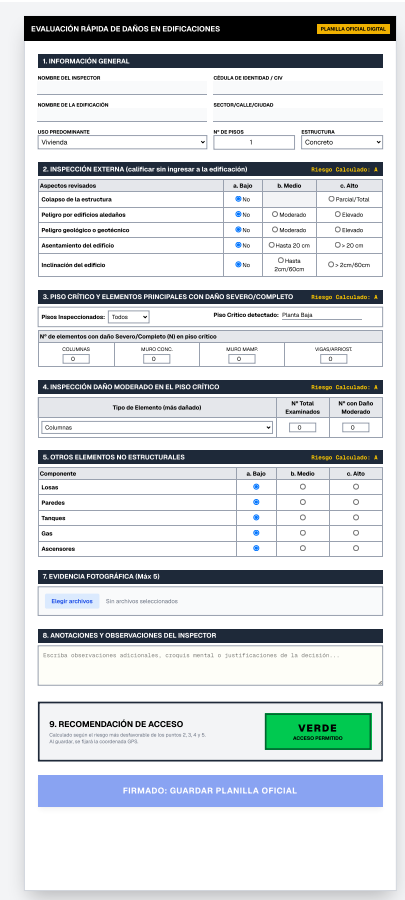
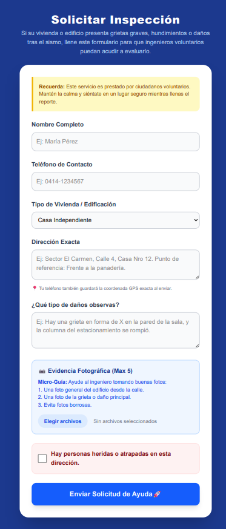

# Reconstruye VE 🇻🇪

**Plataforma Open-Source de Triaje Estructural y Evaluación Rápida de Daños (Estándar ATC-20)**

> *Nuestra intención principal es colaborar en la recolección de datos precisos a través de reportes estandarizados, siguiendo estrictamente los protocolos internacionales (ATC-20 / FUNVISIS).*

Frente a la emergencia, la organización civil guiada por el rigor técnico es nuestra mejor herramienta. Este proyecto es una iniciativa independiente y de código abierto para dotar a los grupos de ingenieros voluntarios (y a la ciudadanía) de una plataforma descentralizada para mapear y certificar daños estructurales de forma rápida e in-situ.

## 🚀 Arquitectura y Módulos del Proyecto (Fase 1 Activa)

El sistema está diseñado para capturar la realidad del terreno en dos niveles, utilizando un enfoque **Offline-First**, captura de **Evidencia Fotográfica** y **PostGIS** para el análisis geoespacial.

### A. Módulo Profesional: Planilla ATC-20 Digital (Inspección In-Situ)

*   **Concepto:** Digitalización *línea por línea* de la "Planilla de Evaluación Rápida de Daños en Edificaciones". Ya no es un asistente, es una **Planilla Vertical Oficial** (Checklist) donde el ingeniero marca cada daño estructural (colapso, columnas, muros) y añade **Anotaciones** libres.
*   **Algoritmo en Vivo:** El sistema calcula automáticamente el Nivel de Riesgo (Bajo, Medio, Alto) por sección y sugiere la **Etiqueta Final (🟢 🟡 🔴)** según el protocolo oficial.
*   **Evidencia Oficial:** Permite al ingeniero capturar y adjuntar hasta 5 fotografías oficiales de los daños.
*   **Ruta Web:** `/evaluacion`

### B. Módulo Ciudadano: Solicitud de Inspección

*   **Concepto:** Un formulario amigable para que el dueño de la edificación afectada solicite ayuda técnica a las brigadas de ingenieros. 
*   **Geolocalización In-Situ:** Extrae las coordenadas GPS automáticamente al momento del envío para que la cuadrilla no se pierda.
*   **Micro-Guía Fotográfica:** Enseña al ciudadano cómo tomar fotos útiles (Max. 5) antes de enviarlas (Ej. *"Una general, una de la grieta, evite fotos borrosas"*).
*   **Ruta Web:** `/solicitud`

## 🛠️ Despliegue en Producción (¿Cómo usar esto en la vida real?)

Este repositorio contiene todo el código listo para funcionar. Si eres un grupo de rescate, una ONG o un grupo de ingenieros voluntarios, así es como debes **activar el uso de esta plataforma**:

1. **Servidor (Hosting):** Debes alquilar un servidor pequeño (VPS) en servicios como **DigitalOcean, Railway o Render**.
2. **Dominio:** Comprar o asignar un dominio web (ej. `www.reconstruye-emergencia.org`) para que la gente no tenga que escribir números IP.
3. **Base de Datos:** El código ya incluye un archivo `docker-compose.yml`. En el servidor, solo debes ejecutar `docker compose up -d` y el sistema levantará la base de datos PostgreSQL con capacidades satelitales (PostGIS).
4. **Despliegue del Frontend:** En la carpeta `/frontend`, debes ejecutar `npm run build` y luego `npm run start` para encender la página web pública. 
5. **¡Listo!** Envíen el link del módulo ciudadano (`/solicitud`) por WhatsApp y Redes Sociales a las zonas afectadas, y entreguen el link del módulo profesional (`/evaluacion`) **solo a los ingenieros colegiados** que irán al terreno.

## 🤝 ¿Cómo colaborar con el código?
¡Necesitamos Desarrolladores Web (React/Next.js) y Expertos en Bases de Datos (Postgres/PostGIS)!

1.  Asegúrate de tener **Docker** y **Node.js** instalados.
2.  Clona este repositorio.
3.  Levanta las bases de datos: `docker compose up -d`
4.  Levanta el servidor web: `cd frontend && npm install && npm run dev`
5.  Revisa los *Issues* en GitHub o abre un *Pull Request* con tus mejoras.

---
*Organización ciudadana aplicada a la tecnología.*
